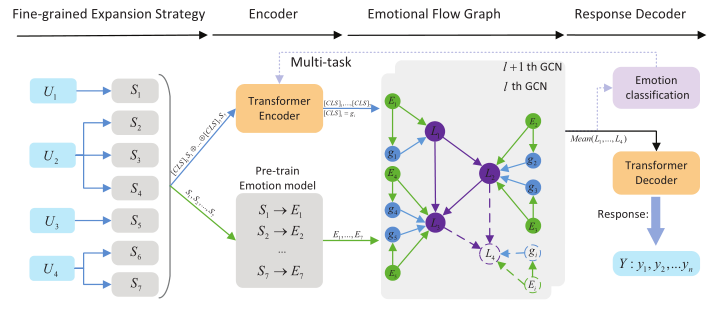

# MuSE: A Multi-scale Emotional Flow Graph Model for Empathetic Dialogue Generation

## 
This repository is the public code for the paper's emotional flow dialogue.

 

## 
You can run easily with main2.py